Space Shooter Ultimate

`An arcade like game built on Java, through TDD`

The space shooter ultimate is a space invaders type game in which the goal is to kill the maximum amount of enemies without losing all your lives. 
The longer you stay alive the more enemies will spawn and the stronger they will be.

This project was developed by [Filipe Cardoso](https://github.com/filipecardoso0) (up202006409@edu.fe.up.pt), [José Isidro](https://github.com/zmiguel2011) (up202006485@edu.fe.up.pt) and [Miguel Nogueira](https://github.com/mnogueira22) (up202005488@edu.fe.up.pt) for LDTS 2021-22.

## IMPLEMENTED FEATURES

- **Single shooting** - Shoots one bullet at once.

  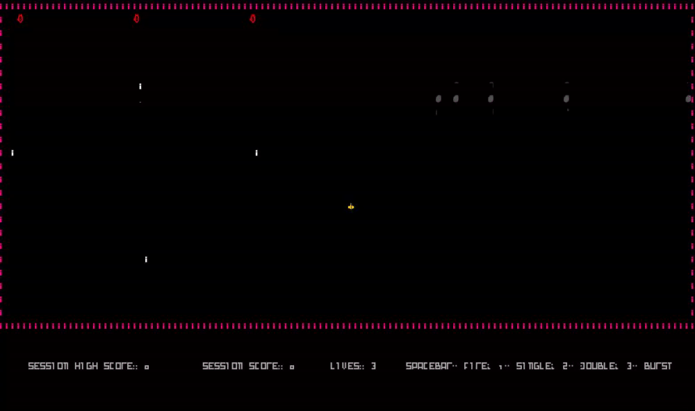

  <b><i>GIF 1. Single Shot</i></b>

 
 

- **Double shooting** - Shoots two bullets at once. However it deals less damage.

  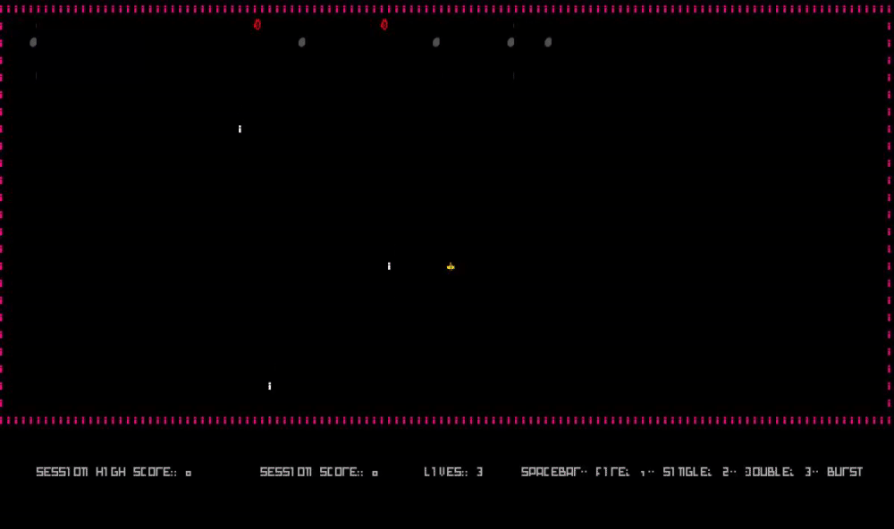

  <b><i>GIF 2. Double Shot</i></b>

 
 

- **Burst shooting** - Shoots bullets in burst. However it deals less damage.

  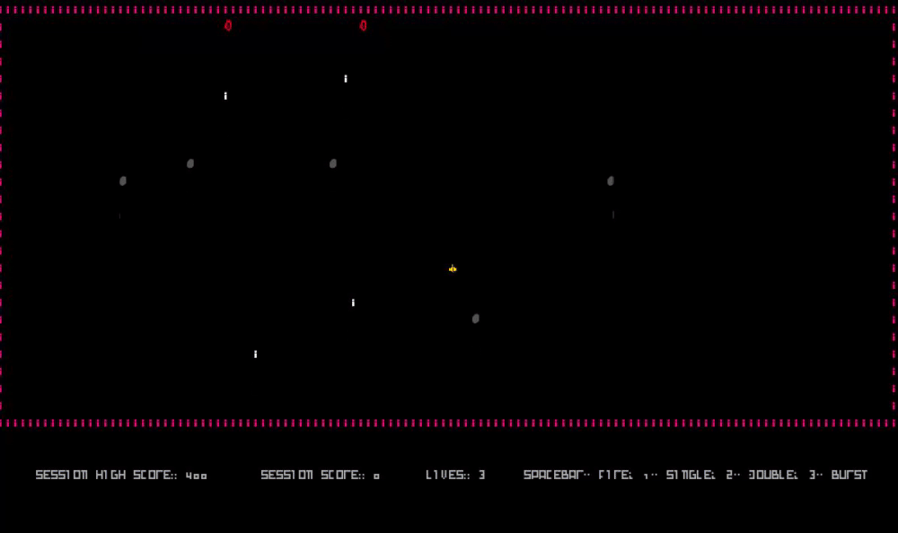

  <b><i>GIF 3. Bust Shot</i></b>

 
 

- **Asteroids** - asteroids will spawn randomly. Try to dodge them.

  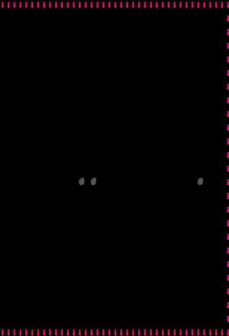

  <b><i>GIF 4. Asteroids</i></b>

 
 

- **Spaceships** - spaceships will spawn and move randomly whilst shooting you. Try to dodge their bullets.

  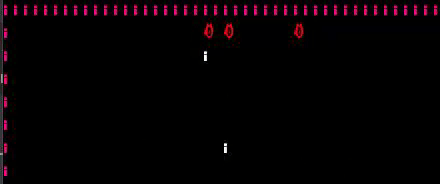

  <b><i>GIF 5. Spaceships</i></b>

 
 

- **Items** - items will spawn randomly after you gain some score points. Try to catch them so you can get more lives. If you happen to have reached the maximum lives, which is 3, you can increase your score.

  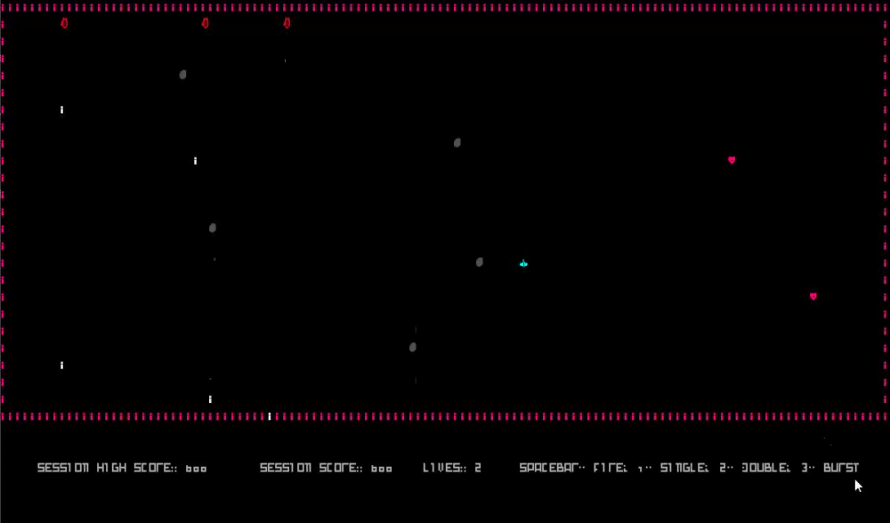

  <b><i>GIF 6. Items</i></b>

 
 

------

## DESIGN

### Architectural Pattern

**Problem in Context**

The architecture of the project is one of the most important parts of a project like this. At first, we weren't able to implement this pattern as we struggled to do so.
Later on the project, we succeeded in its implementation.

**The Pattern**

We have applied the **Model-View-Controller** pattern. This pattern allows you to implement user interfaces, data, and controlling logic separately. This separation between the display and the logic provides for a better division of labor and improved maintenance and better organized code overall.

Our game currently has an MVC module for each one of the three states:

- `Main Menu`
- `Space`
- `Game Over`

**Implementation**

  

  <b><i>Image 1. MVC Diagram</i></b>

 
 

**Consequences**

The use of the Model View Controller Pattern in the current design allows the following benefits:

- Easily Modifiable
- Faster Development Process
- Easy planning and maintenance

------

### GameState

**Problem in Context**

In order to keep playing without having to restart the game, we created a game menu. We then needed a way to efficiently jump between the Game Menu and the Playing Space. Moreover, we also needed a GameOver Menu where the player could either close the game or continue to play.
For that purpose, we needed a way to manage which was the current state of the game and a way change it.

**The Pattern**

We have applied the **State** pattern. This pattern allows you to represent different states with different subclasses. We can switch to a different state of the application by switching to another implementation (i.e., another subclass). This pattern allowed to address the identified problems because now the player can jump between states depending on what he needs to do. 
There is now a `MenuState`, where the game is started so the player can start playing or quit the game. There is a `Playing State` for when the game is being played and there is a `Game Over State` for when the player dies.

**Implementation**

The following figure shows how the pattern’s roles were mapped to the application classes.

  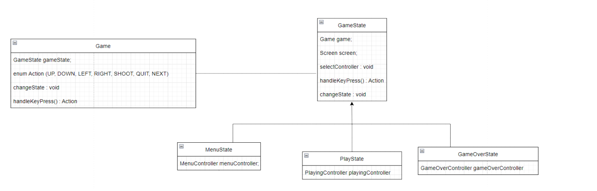

  <b><i>Image 2. State UML Diagram</i></b>

 
 

These classes can be found in the following files:

- [Game](https://github.com/FEUP-LDTS-2021/ldts-project-assignment-g0605/blob/master/src/main/java/com/group605/spaceshooterultimate/Game.java)
- [GameState](https://github.com/FEUP-LDTS-2021/ldts-project-assignment-g0605/blob/master/src/main/java/com/group605/spaceshooterultimate/state/GameState.java)
- [MenuState](https://github.com/FEUP-LDTS-2021/ldts-project-assignment-g0605/blob/master/src/main/java/com/group605/spaceshooterultimate/state/MenuState.java)
- [PlayState](https://github.com/FEUP-LDTS-2021/ldts-project-assignment-g0605/blob/master/src/main/java/com/group605/spaceshooterultimate/state/PlayState.java)
- [GameOverState](https://github.com/FEUP-LDTS-2021/ldts-project-assignment-g0605/blob/master/src/main/java/com/group605/spaceshooterultimate/state/GameOverState.java)

**Consequences**

The use of the State Pattern in the current design allows the following benefits:

- Each state has its own MVC module.
- We don't have to rely on flags.
- There are now more classes and instances to manage, but still in a reasonable number.

------

### Space Builder

#### Problem in Context:
A space consists in an agglomeration of elements such as borders, asteroids, spaceships, a player, items, etc.
This implementation makes it possible to only create specific elements and also generate spaces in different ways, in case we need to add different levels in the future, for instance.

#### The Pattern:
The **_Builder_** is a creational design pattern, which allows a step-by-step creation of complex objects, improving the code. The construction is controlled by a director object that only needs to know the type of object it is to create.
In our case, the director is the `PlayState`.

#### Implementation:

As for the implementation, the SpaceBuilder is a class which knows how to construct a space, however only its methods can supply the necessary components of the spaces.
The builder pattern is implemented in all the above classes by dividing the construction in smaller steps.

  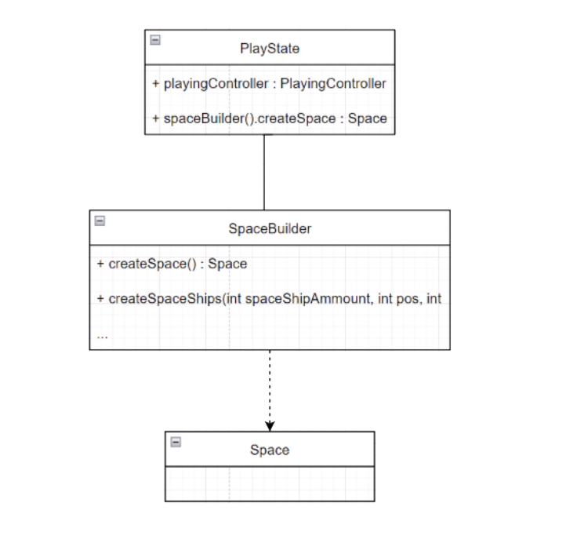

  <b><i>Image 3. Space Builder UML</i></b>

These classes can be found in the following files:
- [PlayState](https://github.com/FEUP-LDTS-2021/ldts-project-assignment-g0605/blob/master/src/main/java/com/group605/spaceshooterultimate/state/PlayState.java)
- [SpaceBuilder](https://github.com/FEUP-LDTS-2021/ldts-project-assignment-g0605/blob/31ba1dec299d0708324b2b853c7e5b62ad957aba/src/main/java/com/group605/spaceshooterultimate/model/space/SpaceBuilder.java)
- [Space](https://github.com/FEUP-LDTS-2021/ldts-project-assignment-g0605/blob/31ba1dec299d0708324b2b853c7e5b62ad957aba/src/main/java/com/group605/spaceshooterultimate/model/space/Space.java)

#### Consequences:
Benefits of applying the above pattern:
- You avoid tight coupling between the creator and the concrete products.
- Open/Closed Principle. You can introduce new types of products into the program without breaking existing client code.
- You can construct objects step-by-step, defer construction steps or run steps recursively.

------

### Code Smells AND Possible Refactoring

#### Switch Statements and Code Duplicate

We have spotted was the high use of complex **Switch Statements** to perform tasks like moving through the menus or moving the player. This will result in **Duplicate Code**. 
In order to solve this we could use the `Observer Design Pattern` which will be useful since a few objects in the app must observe others in certain cases. For instance, we should create a Keyboard Observer and Listener which would solve the duplicate code showed in the image below.

  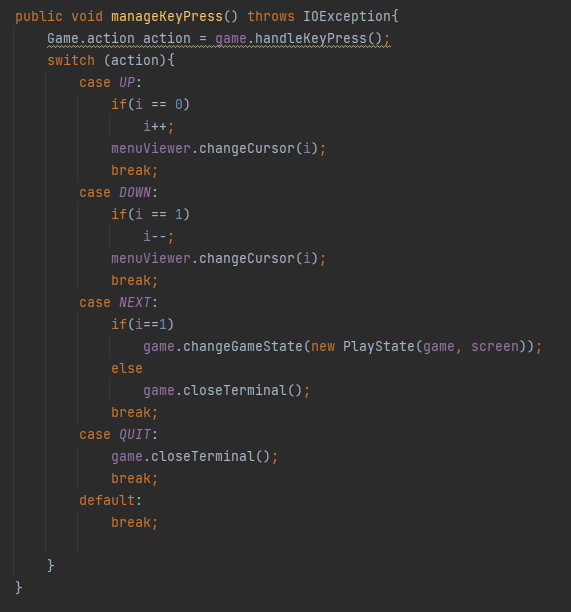

  <b><i>Image 4. Code Duplicate</i></b>

 
 

#### Lazy Class

The class [SingleShot](https://github.com/FEUP-LDTS-2021/ldts-project-assignment-g0605/blob/master/src/main/java/com/group605/spaceshooterultimate/model/entity/SingleShot.java), [DoubleShot](https://github.com/FEUP-LDTS-2021/ldts-project-assignment-g0605/blob/master/src/main/java/com/group605/spaceshooterultimate/model/entity/DoubleShot.java) and [BurstShot](https://github.com/FEUP-LDTS-2021/ldts-project-assignment-g0605/blob/master/src/main/java/com/group605/spaceshooterultimate/model/entity/BurstShot.java) are an examples of **Lazy Classes** in our code.
These classes extend the [Bullet](https://github.com/FEUP-LDTS-2021/ldts-project-assignment-g0605/blob/master/src/main/java/com/group605/spaceshooterultimate/model/entity/Bullet.java) class, but they only use its constructor to set their position and damage. 
Removing these classes would make the code a little simpler since they could be implemented as be a method of their parent class.

  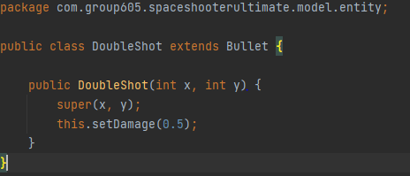

  <b><i>Image 5. Lazy Class - DoubleShot</i></b>

 
 

------

## TESTING

- Screenshot of coverage report.

  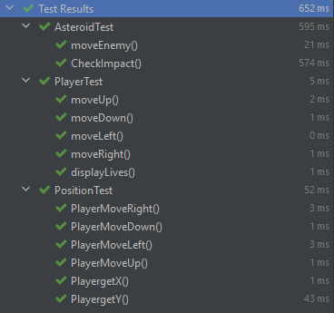

  <b><i>Image 6. test.png</i></b>

 
 

### SELF-EVALUATION

- Filipe Cardoso: 33.3%
- José Isidro: 33.3%
- Miguel Nogueira: 33.3%
