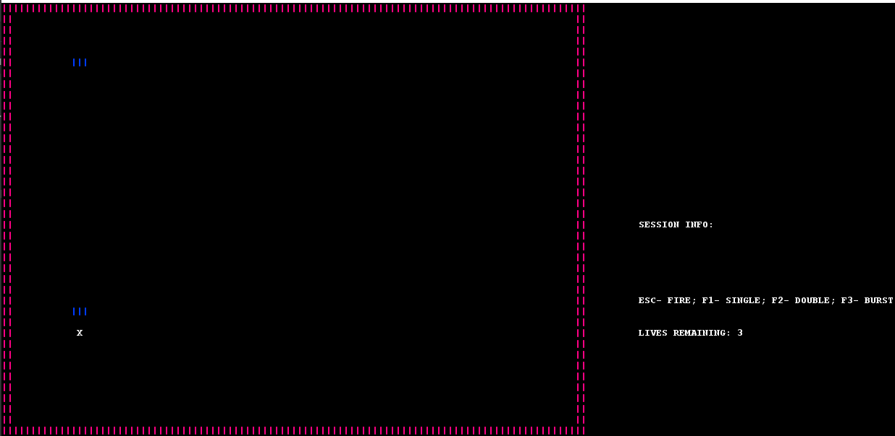
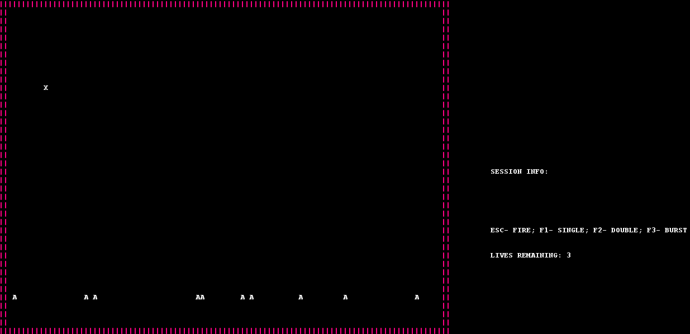
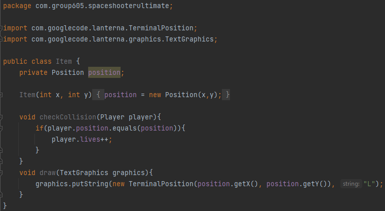
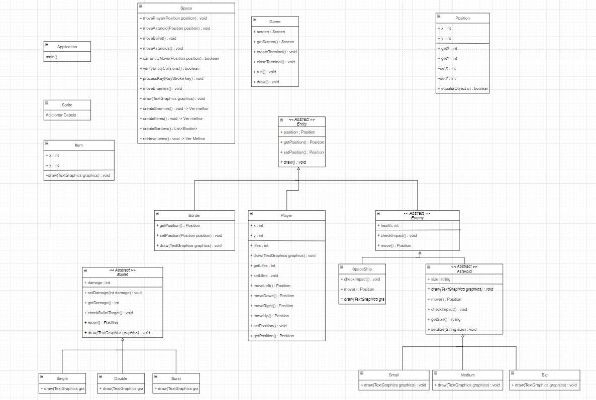

# LDTS_T06_G605 - Space Shooter Ultimate

The space shooter ultimate is a space invaders type game in which the goal is to kill the maximum amount of enemies without losing all your lives. 
The longer you stay alive the more enemies will spawn and the stronger they will be.

This project was developed by [Filipe Cardoso](https://github.com/filipecardoso0) (up202006409@edu.fe.up.pt), [José Isidro](https://github.com/zmiguel2011) (up202006485@edu.fe.up.pt) and [Miguel Nogueira](https://github.com/mnogueira22) (up202005488@edu.fe.up.pt) for LDTS 2021-22.

### IMPLEMENTED FEATURES

- **Single shooting** - Shoots one bullet at once.

  

  <b><i>Imagem 1. Single Shot</i></b>

 
<br/

- **Double shooting** - Shoots two bullets at once. However it deals less damage.

  

  <b><i>Imagem 2. Double Shot</i></b>

 
 

- **Burst shooting** - Shoots bullets in burst. However it deals less damage.

  

  <b><i>Imagem 3. Bust Shot</i></b>

 
 

- **Asteroids** - asteroids will spawn randomly. Try to dodge them.

  

  <b><i>Imagem 4. Asteroid</i></b>

 
 

### PLANNED FEATURES

> This section is similar to the previous one but should list the features that are not yet implemented. Instead of screenshots you should include GUI mock-ups for the planned features.
- **Items** - every once in a while a item will spawn to help the player survive.

  

  <b><i>Imagem 5. Item Mock up</i></b>

 
 

- **Enemy spaceships** - Unlike asteroids enemy spaceships will shoot at you.

  

  <b><i>Imagem 6. Spaceship Mock up</i></b>

 
 

### DESIGN

**Implementation**

The following figure shows how the pattern’s roles were mapped to the application classes.

  

  <b><i>Imagem 7. uml diagram</i></b>

 
 

### TESTING

- Screenshot of coverage report.

  

  <b><i>Imagem 8. test.png</i></b>

 
 

- Filipe Cardoso: 33.3%
- José Isidro: 33.3%
- Miguel Nogueira: 33.3%
